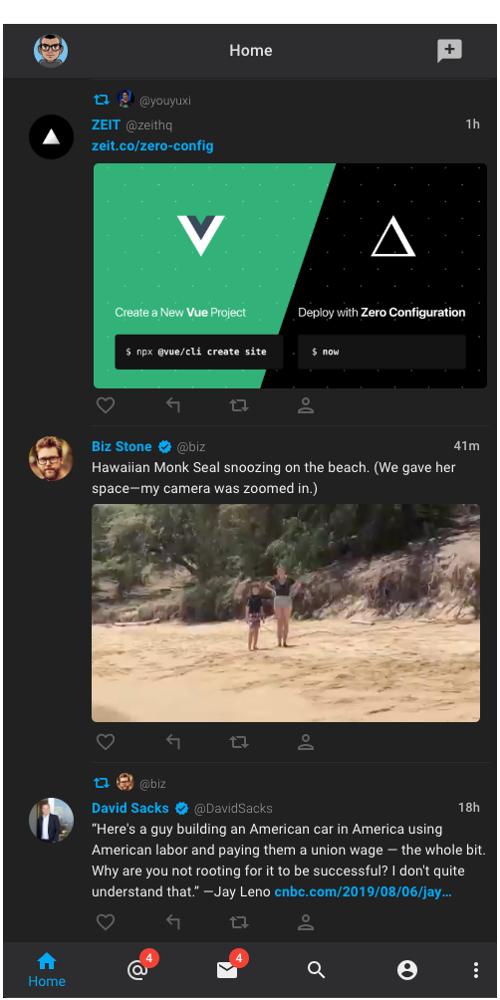

[](https://badge.fury.io/gh/vtavarez%2FTweete)

## Tweete

Twitter application for Linux. Built on Electron and React.

## Preview

| Login                                | App                                |
| ------------------------------------ | ---------------------------------- |
|  |  |

## Installation

```
git clone
npm install
```

## Setup

1. Head to [developer.twitter.com](https://developer.twitter.com/en/apply-for-access) and apply for twitter api access.
2. Create a directory named "data" in the src directory, and generate a config.json file with your twitter api key and secret.

```
/src/data/config.json

{
"key": KEY,
"secret": SECRET
}
```

## Run

Once you've done the installation and setup steps above, you can run the app with `npm start`.

## Build

When your ready to deploy, run the npm scripts below.

```
npm pre-electron-pack
npm electron-pack
```

`pre-electron-pack` will run the CRA build process.

`electron-pack` will package the CRA build files, any assets in src assets folder, and app dependencies for distribution via Snapcraft.

## Inspiration & Thanks

Twitter,
TweetBot,
[Tweete Icon by Pixel Buddah](https://www.flaticon.com/authors/pixel-buddha")
